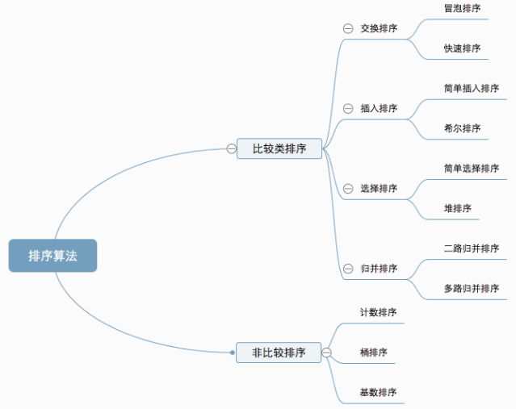

## 十大经典排序算法
### 0.算法概述
十种常见排序算法可以分为两大类：
*   **比较类排序**：通过比较来决定元素间的相对次序，由于其时间复杂度不能突破O(nlogn)，因此也称为非线性时间比较类排序。
*   **非比较类排序**：不通过比较来决定元素间的相对次序，它可以突破基于比较排序的时间下界，以线性时间运行，因此也称为线性时间非比较类排序。
`概览图`

算法复杂度：
待补充
### 1.冒泡排序
```cpp
void BubbleSort()
{
    for (int i = 0; i < NUM; i++)
    {
        //每循环一次，最大值被移动到最右边
        for (int j = 0; j < NUM-1-i; j++)
        {
            if(input[j]>input[j+1])
            {
                int tmp=input[j+1];
                input[j+1]=input[j];
                input[j]=tmp;
            }
        }
    }
}
```
### 2.选择排序
```cpp
void selectionSort()
{
    for(int i=0;i<NUM;i++)
    {
        int minVal=input[i];
        int index=i;
        for(int j=i+1;j<NUM;j++)
        {
            if(input[j]<minVal)
            {
                minVal=input[j];
                index=j;
            }
        }
        int tmp=input[i];
        input[i]=input[index];
        input[index]=tmp;
    }
}
```
### 3.插入排序
```cpp
void insertionSort()
{
    for(int i=1;i<NUM;i++)
    {
        int cur=input[i];
        int preIndex=i-1;
        while(preIndex>=0&&cur<input[preIndex])
        {
            input[preIndex+1]=input[preIndex];
            preIndex--;
        }
        input[preIndex+1]=cur;
    }
}
```
### 4.希尔排序
希尔排序是第一个突破O(n*n)的排序算法，是简单插入排序的改进版本。
```cpp
void swap(int& v1,int& v2)
{
    int tmp=v1;
    v1=v2;
    v2=tmp;
}
void adjust(int index,int len)
{
    int left=index*2+1;
    int right=index*2+2;
    int maxIndex=index;
    if(left<len&&input[left]>input[maxIndex]) maxIndex=left;
    if(right<len&&input[right]>input[maxIndex]) maxIndex=right;
    if(maxIndex!=index)
    {
        swap(input[maxIndex],input[index]);
        adjust(maxIndex,len);
    }
}
void shellSort()
{
    for(int i=NUM/2-1;i>=0;i--)
    {
        adjust(i,NUM);
    }
    for(int i=NUM-1;i>0;i--)
    {
        swap(input[0],input[i]);
        adjust(0,i);
    }
}
```
### 5.归并排序
分治算法的典型应用
```cpp
typedef bool(*CompareFunc)(int,int);
bool compare(int left,int right)
{
    return left<right;
}
void mergeSort(int input[],int left,int mid,int right,CompareFunc comp)
{
    if(left>=mid||mid>=right) return;
    int* tmp=new int(right-left);
    int index=0;
    int leftP=left;
    int midP=mid;
    while(leftP<mid&&midP<right)
    {
        if(comp(input[leftP],input[midP])) 
        {
            tmp[index]=input[leftP];
            leftP++;
        }
        else 
        {
            tmp[index]=input[midP];
            midP++;
        }
        index++;
    }
    if(midP<right)
    {
        memcpy(tmp+index,input+midP,sizeof(int)*(right-midP));
    }
    else if(leftP<mid)
    {
        memcpy(tmp+index,input+leftP,sizeof(int)*(mid-leftP));
    }
    memcpy(input+left,tmp,sizeof(int)*(right-left));
    delete[] tmp;
    tmp=NULL;
}
void mergeSort(int input[],int left,int right,CompareFunc comp)
{
    if(input==NULL||right-left<=1) return;
    int mid=(left+right)/2;
    sort(input,left,mid,comp);
    sort(input,mid,right,comp);
    mergeSort(input,left,mid,right,comp);
}
```
### 6.快速排序
选取一个基准数，将待排序的数列分成两组。
```cpp
void quickSort(int left,int right)
{
    if(left>=right) return;
    int i=left;
    int j=right;
    int base=input[left];
    int temp;
    while(i<j)
    {
        while(input[j]>=base && i<j) j--;
        while(input[i]<=base && i<j) i++;
        if(i<j)
        {
            temp=input[i];
            input[i]=input[j];
            input[j]=temp;
        }
    }
    input[left]=input[i];
    input[i]=base;
    sort(left,i-1);
    sort(i+1,right);
}
```
### 7.堆排序
要点
*   堆是一颗完全二叉树；
*   小（大）顶堆中的每一个节点都不小于（不大于）它的父节点；
*   堆的插入、删除元素的时间复杂度都是O(log n)；
*   建堆的时间复杂度是O(n)；
*   堆排序的时间复杂度是O(nlog n)；
*   堆排序的空间复杂度是O(1)​；​
```cpp
void swap(int& v1,int& v2)
{
    int tmp=v1;
    v1=v2;
    v2=tmp;
}
void adjust(int index,int len)
{
    int left=index*2+1;
    int right=index*2+2;
    int maxIndex=index;
    if(left<len&&input[left]>input[maxIndex]) maxIndex=left;
    if(right<len&&input[right]>input[maxIndex]) maxIndex=right;
    if(maxIndex!=index)
    {
        swap(input[maxIndex],input[index]);
        adjust(maxIndex,len);
    }
}
void heapSort()
{
    for(int i=NUM/2-1;i>=0;i--)
    {
        adjust(i,NUM);
    }
    for(int i=NUM-1;i>0;i--)
    {
        swap(input[0],input[i]);
        adjust(0,i);
    }
}
```
[参考链接一](https://www.cnblogs.com/wanglei5205/p/8733524.html)
[参考链接二](https://www.cnblogs.com/tong-yuan/p/Heap.html)
### 8.计数排序
**桶排序**的特殊情况
```cpp
int maxValue()
{
    int maxVal=0;
    for(int i=0;i<NUM;i++)
    {
        maxVal=input[i]>maxVal?input[i]:maxVal;
    }
    return maxVal;
}
void countingSort()
{
    int maxVal=maxValue();
    int array[maxVal+1]={};
    for(int i=0;i<NUM;i++)
    {
        array[input[i]]++;
    }
    int index=0;
    for(int i=0;i<maxVal+1;i++) while (array[i]--) input[index++]=i;
}
```
### 9.桶排序
```cpp
int maxValue()
{
    int maxVal=input[0];
    for (int i = 1; i < NUM; i++)
    {
        maxVal=maxVal>input[i]?maxVal:input[i];
    }
    return maxVal;
    
}
int minValue()
{
    int minVal=input[0];
    for(int i=1;i<NUM;i++)
    {
        minVal=minVal<input[i]?minVal:input[i];
    }
    return minVal;
}
void insertionSort(vector<int>& vec)
{
    for(int i=1;i<vec.size();i++)
    {
        int cur=vec[i];
        int preIndex=i-1;
        while(preIndex>=0&&cur<vec[preIndex])
        {
            vec[preIndex+1]=vec[preIndex];
            preIndex--;
        }
        vec[preIndex+1]=cur;
    }
}
void bucketSort(int bucketSize)
{
    int minVal=minValue();
    int maxVal=maxValue();
    int bucketCount=(maxVal-minVal)/bucketSize+1;
    vector<vector<int> > vec(bucketCount);
    for(int i=0;i<NUM;i++)
    {
        vec[(input[i]-minVal)/bucketSize].push_back(input[i]);
    }
    int index=0;
    for(int i=0;i<bucketCount;i++)
    {
        if(vec[i].size()!=0)
        {
            insertionSort(vec[i]);
            for(int j=0;j<vec[i].size();j++)
            {
                input[index++]=vec[i][j];
            }
        }
    }
}
```
### 10.基数排序
```cpp
int maxBit()
{
    int res=1;
    for(int i=0;i<NUM;i++)
    {
        int num=input[i];
        int bit=0;
        while(num)
        {
            bit++;
            num/=10;
        }
        res=bit>res?bit:res;
    }
    return res;
}
void radixSort(int max_bit)
{
    vector<vector<int> > vec(10);
    int dev=1;
    int mod=10;
    for(int i=0;i<max_bit;i++,dev*=10,mod*=10)
    {
        for(int j=0;j<NUM;j++)
        {
            int index=input[j]%mod/dev;
            vec[index].push_back(input[j]);
        }
        int index=0;
        for(int j=0;j<10;j++)
        {
            if(vec[j].size()!=0)
            {
                for(int k=0;k<vec[j].size();k++)
                {
                    input[index++]=vec[j][k];
                }
                vec[j].clear();//要清空，不然出错
            }
        }
    }
}
```
### 参考链接
[十大经典排序算法（动图演示）](https://www.cnblogs.com/onepixel/articles/7674659.html)