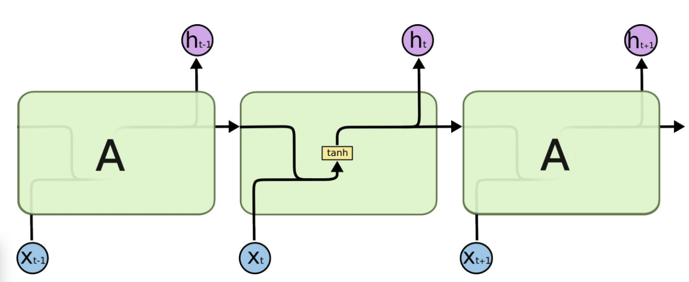
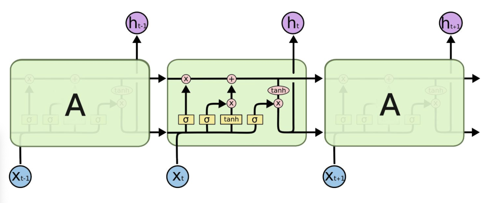
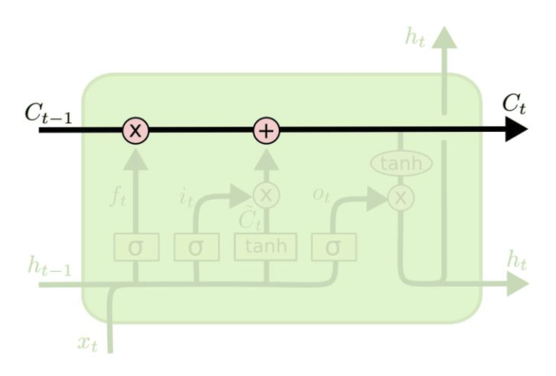
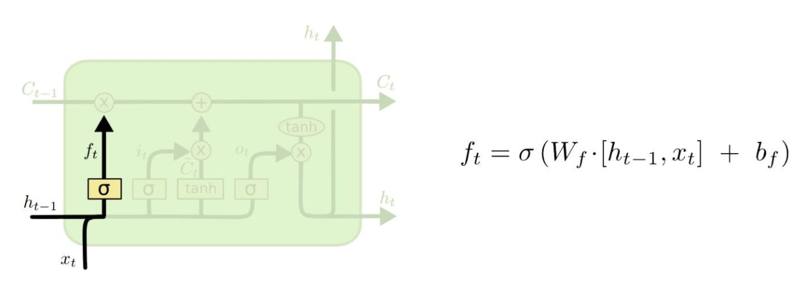
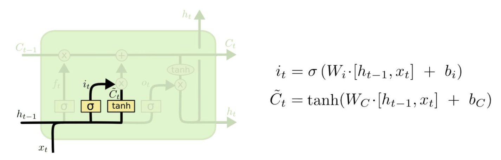
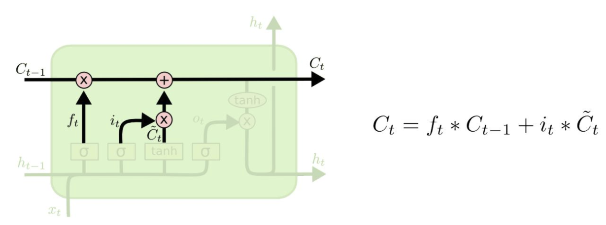
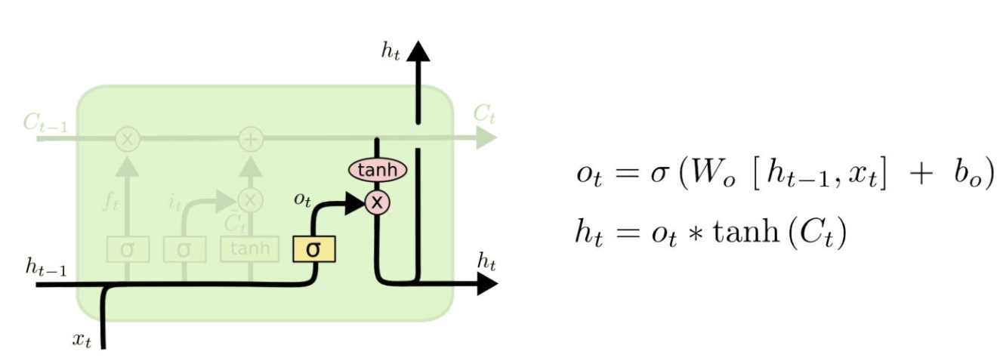

# LSTM
在 2015 年，谷歌通过基于CTC 训练的 LSTM 程序大幅提升了安卓手机和其他设备中语音识别的能力，苹果的Siri中也使用了LSTM；微软不仅将LSTM用于语音识别，还将这一技术用在虚拟对话形象生产等应用。亚马逊的ALexa通过双向LSTM实现智能语言机器人。
### RNN(Recurrent Neural Networks)
####网络结构
.png)
.png)
#### 缺陷
* 对于较长的序列，记忆能力不是很好，只能记忆较短的序列。
例如：
`I am French(2000 words later)I speak fluent French`
* 传统的RNN网络非常难训练，容易梯度弥散或者梯度爆炸
### LSTM
#### 标准RNN结构
这个重复模块具有非常简单的结构，例如单个tanh层

#### LSTM的结构
##### 整体结构

##### cell state(long term)

##### 遗忘门

##### 输入门

##### cell state

##### 输出门
输出的`ht`与下一次的x(t+1)作为新的数据递归输入到下一个中

### LSTM的应用
#### NLP(natural languge processing)
NLP是现在LSTM最热门的应用方向之一，包括文字，段落，口音等等的分析，在翻译,情感分析，文本生成方面。
这是一种many to many的模式，也就是输入为一个序列，输出也是一个序列。
[例子](https://www.youtube.com/watch?v=mLxsbWAYIpw)
#### automatic speech recognition

#### video description

#### video Classification

#### Write Like Shakespeare

#### 写代码，作曲等等

## 参考
[Andrej Karpathy's blog](http://karpathy.github.io/2015/05/21/rnn-effectiveness/)
[Colah's blog](http://colah.github.io/posts/2015-08-Understanding-LSTMs/)