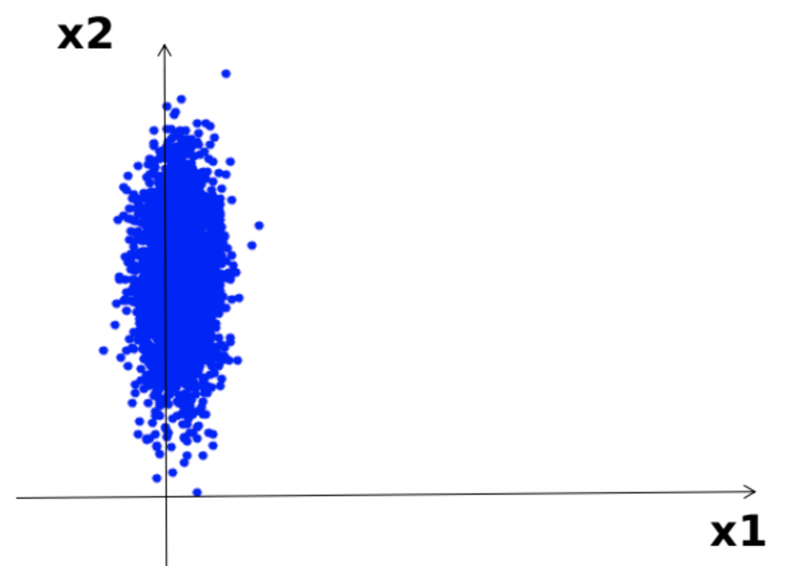
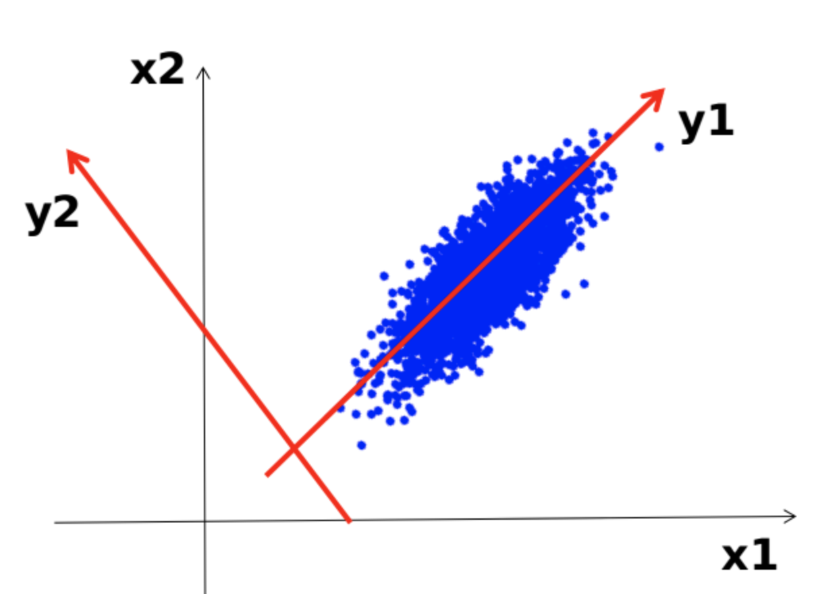
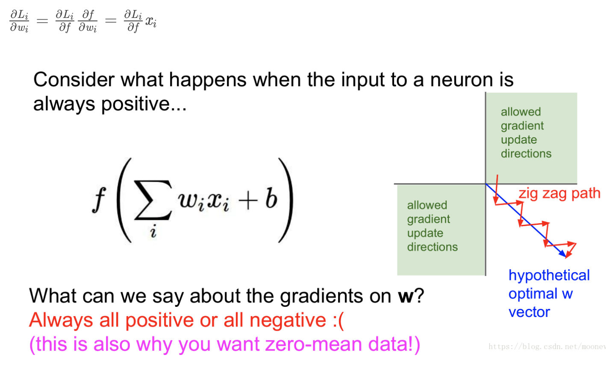

### PCA
PCA（principle component analysis），中文：主成分分析
作用：降维
`可以忽略x1轴信息`

`可以忽略y1轴信息`

PCA限制较多，要求数据是线性分布的，AutoEncoder可以解决非线性问题。
### zero-mean
中文名：零均值化/零中心化
```python
x_train = load_data(img_dir)  # 读取图片数据 x_train的shape为(5000,32,32,3)
x_train = np.reshape(x_train, (x_train.shape[0], -1))  # 将图片从二维展开为一维，x_train 变为(5000,3072)
mean_image = np.mean(x_train, axis=0)  # 求出所有图片每个像素位置上的平均值 mean_image为(1, 3072)
x_train -= mean_image  # 减去均值图像，实现零均值化
```
作用：在反向传播中加快网络中每一层权重参数的收敛
原因：假设图中蓝色箭头方向理想最优w向量，根据上述公式，我们可以想一想：

当x全为正或者全为负时，每次返回的梯度都只会沿着一个方向发生变化，即梯度变化的方向就会向图中红色箭头所示，一会向上太多，一会向下太多。这样就会使得权重收敛效率很低。

但当x正负数量“差不多”时，就能对梯度变化方向进行“修正”，使其接近上图中蓝色箭头的方向，加速了权重的收敛。

没懂